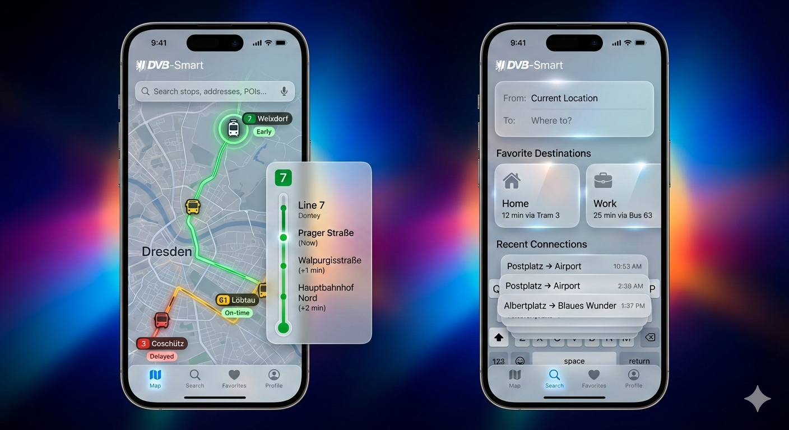

#  DVB-Smart

DVB-Smart is a high-end public transportation app for the Dresden (VVO) area, featuring a modern **Apple-inspired Liquid Glass (Glassmorphism)** design. It provides real-time vehicle tracking, route information, and connection search with a focus on user experience and aesthetics.

## Features

- **Apple Liquid Glass Design**: Sophisticated glassmorphism effects with frosted glass cards, vibrant gradients, and smooth animations.
- **Live Vehicle Map**: Track buses and trams across Dresden in real-time.
- **Punctuality Indicators**:
    - 🟢 **Green**: Early
    - 🟡 **Yellow**: On-time (DVB Yellow)
    - 🔴 **Red**: Delayed
- **Interactive Routes**: Click on any vehicle on the map to see its full route drawn as a line and a vertical "thermometer" stop list.
- **Smart Search**: Find stops, addresses, and Points of Interest (POIs) using integrated geocoding.
- **Connection Search**: One-tap navigation from your location to your favorite destinations (Home, Work, etc.).
- **Dual Mode Support**: Fully optimized for both Light and Dark modes.
- **Localization**: Available in **German** (default) and **English**.

## Screenshots



*The high-fidelity Liquid Glass design with live map tracking and connection search.*

## Built With

- **Kotlin** & **Jetpack Compose**: Modern Android UI toolkit.
- **MapLibre SDK**: High-performance vector maps.
- **Retrofit & OkHttp**: Robust networking for transit and geocoding data.
- **VVO WebAPI**: Real-time transit data from Verkehrsverbund Oberelbe.
- **Photon API**: Open-source geocoding for address and POI search.

## Getting Started

### Prerequisites
- Android Studio Iguana or newer.
- JDK 17.

### Building
1. Clone the repository.
2. Open in Android Studio.
3. Build and run the `app` module.

Alternatively, use the Gradle wrapper:
```bash
./gradlew assembleDebug
```

## Credits
This app is powered by the open transit data of [VVO](https://www.vvo-online.de) and [DVB](https://www.dvb.de).
Inspired by Apple's glassmorphism design language.
